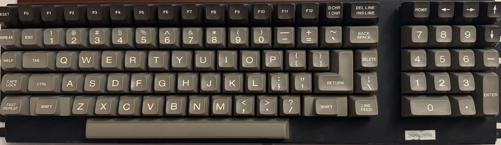

# Heathkit H-100 to Raspberry Pi Conversion

## About
I came across a Heathkit H-100 (Clone of the Zenith Z-100) low profile version, but the powersupply was dead, and unable to use the boards because of the non-standard power supply voltages. So this is documentation of my journey to wire up the Keyboard to be used by a Raspberry Pi so I can use it as if it were a working H-100 but instead is powered by a Raspberry Pi.

## Keyboard Conversion

### Keyboard Layout
The keyboard layout is based on the H-100 or Z-100 Keyboard Layout.
View the keyboard layout in the [keyboard-layout.json](keyboard-layout.json) file.
You can also view the keyboard layout in the [Keyboard Layout Editor](https://www.keyboard-layout-editor.com/##@@=Reset&=F0&=F1&=F2&=F3&=F4&=F5&=F6&=F7&=F8&=F9&=F10&=F11&=F12&=D%20Chr%0AI%20Chr&_w:1.5%3B&=DEL%20Line%0AINS%20Line&_x:1%3B&=HOME&=%E2%86%90&=%E2%86%92&=%E2%86%91%3B&@=Break&=ESC&=!%0A1&=%2F@%0A2&=%23%0A3&=$%0A4&=%25%0A5&=%5E%0A6&=%2F&%0A7&=*%0A8&=(%0A9&=)%0A0&=%2F_%0A-&=+%0A%2F=&=~%0A%60&_w:1.5%3B&=Back%20Space&_x:1%3B&=7&=8&=9&=%E2%86%93%3B&@=HELP&_w:1.5%3B&=Tab&=Q&=W&=E&=R&=T&=Y&=U&=I&=O&=P&=%7B%0A%5B&=%7D%0A%5D&_w:1&h:2&w1:2.25&h2:1&x2:-0.75&y2:1%3B&=Return&=Delete&_x:1%3B&=4&=5&=6&=-%3B&@_w:1.25%3B&=Caps%20Lock&_w:1.5%3B&=CTRL&=A&=S&=D&=F&=G&=H&=J&=K&=L&=%2F:%0A%2F%3B&=%22%0A'&_x:1.75%3B&=%7C%0A%5C&_x:1%3B&=1&=2&=3&_h:2%3B&=Enter%3B&@_w:1.25%3B&=Fast%20Repeat&_w:2%3B&=Shift&=Z&=X&=C&=V&=B&=N&=M&=%3C%0A,&=%3E%0A.&=%3F%0A%2F%2F&_w:2%3B&=Shift&_w:1.25%3B&=Line%20Feed&_x:1%3B&_w:2%3B&=0&=.%3B&@_x:3.75%3B&_a:7&w:9%3B&=)

### Keyboard Wiring Pinout

The keyboard uses two wire bundles for connectivity:
- 20-wire bundle
- 10-wire bundle

### Key Matrix Connections

The csv file [keyboard-matrix.csv](keyboard-matrix.csv) contains the key matrix connections for the keyboard.
(Note: numbering starts at 0)

### LED Connection
The RESET LED is connected to pins 10 and 20 of the 20-wire bundle. Use 3V + to pin 19 and - to pin 20.

